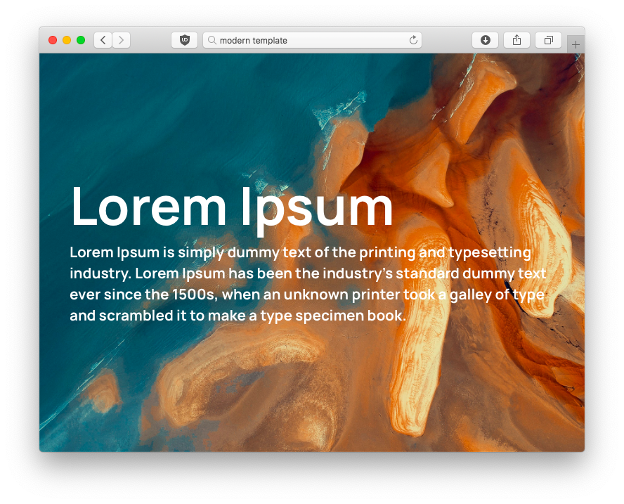

# Modern Template

+ **Link to live demo:** [Demo](https://ivan-avalos.github.io/modern-template)

This is a beautiful and modern HTML template with a design based on the latest web design trends: big images, big text, geometric fonts and more! Everything while keeping it lightweight and fast. There's not even JavaScript yet! That makes it really modern yet fast and efficient. I was inspired by websites like _Apple_, _Huawei_ and _Spotify_ to create this beauty.

## Typography

This template uses the geometric typeface **Manrope**, which looks pretty good in any size and gives a modern look to the website. Thanks to the Manrope Project Autors for providing this font for free, for both personal and commercial use.

## Credits

| Project | Author | Licence |
| ---|---|---|
| [Bootstrap CSS](https://getbootstrap.com) | Twitter, Inc. | MIT |
| [Manrope](https://github.com/sharanda/manrope) | The Manrope Project Authors | OFL |

+ Pictures were taken from [Pexels](https://pexels.com) and [Pixabay](https://pixabay.com).
+ The footer was taken from [MDBootstrap](https://mdbootstrap.com/docs/jquery/navigation/footer/).

## Licence

This project is licensed under the MIT license. For more information, check the `LICENCE` file included in this repository.